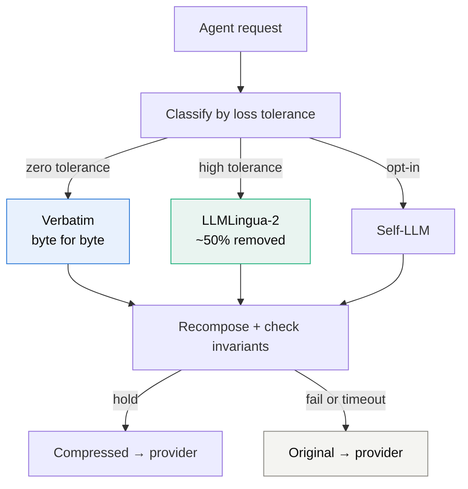

# leanctx

[](https://pypi.org/project/leanctx/)
[](https://pypi.org/project/leanctx/)
[](LICENSE)

**Drop-in prompt compression for production LLM applications.**
Cut your input-token bill by 40–60% — without changing your code.

```python
# before
from openai import OpenAI

# after
from leanctx import OpenAI  # same interface, compressed requests
```

On the public **[LongBench v2](https://longbench2.github.io/)** leaderboard's short subset, leanctx-Lingua **doubles accuracy** versus naive head+tail truncation (40 % vs 20 %) while removing **57 % of tokens**. Open-source models, runs locally, MIT-licensed. Your prompts and user data never leave your infrastructure by default.

[Quickstart](#quickstart-60-seconds) · [What makes it different](#what-makes-it-different) · [Benchmarks](#real-numbers) · [Used in production](#used-in-production) · [How it works](#how-it-works)

---

## What makes it different

**Loss-tolerance routing** — classify every segment of a prompt by how much
distortion it can survive, then compress each class differently.



| Class | Content | Treatment | Effect |
|---|---|---|---|
| **Zero tolerance** | code, stack traces, `tool_use_id`, tool name and input, JSON | verbatim | 0 % altered |
| **High tolerance** | documentation, retrieved passages, logs, prior turns | LLMLingua-2, on-device | ~50 % removed |
| **Conditional** | low-confidence prose, oversized context | self-LLM, opt-in | 41–49 % removed |

Compression applied uniformly to a prompt will eventually damage the one part that
cannot survive being touched, and will do so unpredictably. The hard part is not
shortening text — it is deciding, inside a live request, what may be shortened at all.

---

## Quickstart (60 seconds)

```bash
pip install 'leanctx[openai,lingua]'    # or [anthropic], [gemini]
```

```python
from leanctx import OpenAI

client = OpenAI(
    leanctx_config={
        "mode": "on",
        "trigger": {"threshold_tokens": 2000},
        "routing": {"prose": "lingua"},  # route prose through LLMLingua-2
    },
)

response = client.chat.completions.create(
    model="gpt-4o-mini",
    max_tokens=512,
    messages=[{"role": "user", "content": LONG_DOCUMENT}],
)

print(response.usage.leanctx_tokens_saved)  # e.g. 1841
print(response.usage.leanctx_ratio)         # e.g. 0.49
```

> **First Lingua call loads ~1.2 GB of model weights** to `~/.cache/huggingface/`. Subsequent calls reuse the cache. Add `pip install 'leanctx[lingua]'` to opt in; without it, leanctx falls back to passthrough.

Verify the install with no API key needed:

```bash
leanctx bench list                                   # 7 registered scenarios
leanctx bench run agent-structural --workload agent  # 5 invariants enforced, exit 0 = pass
```

## Why this exists

You're building a production LLM app and your token bill is a line item:

- RAG apps with large retrieved documents
- Long-running conversational agents (LangChain / LangGraph / CrewAI)
- Document-processing pipelines
- Coding agents — Cursor-like / Claude-Code-like, with growing tool-call histories

Existing options have gaps:

- **Provider prompt caching** (Anthropic / OpenAI / Gemini) wins on stable prefixes — system prompts, tool definitions, retrieved-document pools. **It doesn't help with dynamic per-query content** (chat history, freshly retrieved docs, tool outputs). Compose with leanctx, don't choose between them.
- **Naive truncation** drops the middle of the document, exactly where many answers live. The LongBench v2 numbers above show this concretely.
- **Hosted compression APIs** (Compresr, Token Company) require sending your context to their servers. Closed-source models. leanctx is MIT-licensed, runs the model locally, and never makes outbound calls except to your existing provider.

## Real numbers

### Public benchmark — LongBench v2 (Tsinghua KEG, 503 questions, 8K–2M words)

15-item short-subset ablation, Claude Haiku 4.5 eval, 20K head+tail truncation cap (rate-limit-friendly). Same model, same questions, same truncation across all three conditions — so the comparison is apples-to-apples. Full 503-item sweep is on the v0.3.x roadmap.

| Method | Accuracy | Tokens kept | Reproduce |
|---|---:|---:|---|
| Baseline (head+tail truncation only) | 20.0 % (3/15) | 100 % of 20K cap | `leanctx bench run longbench-v2` |
| **leanctx Lingua** (ratio=0.5) | **40.0 % (6/15)** | **43 %** | `LEANCTX_LBV2_COMPRESSOR=lingua leanctx bench run longbench-v2` |
| leanctx SelfLLM (Haiku, ratio=0.3) | 26.7 % (4/15) | 1.4 % | `LEANCTX_LBV2_COMPRESSOR=selfllm leanctx bench run longbench-v2` |

Lingua **doubles** the baseline accuracy while removing 57 % of tokens. Naive head+tail truncation drops the middle; Lingua's extractive token classifier keeps answer-bearing tokens distributed across the full document. Per-question records: [`docs/blog/data/lbv2-2026-05-03/`](docs/blog/data/lbv2-2026-05-03/).

### Internal benchmark — coding-agent transcript

A realistic 9-message agent transcript — user question, file reads, grep, log dumps, failed edit, error trace — totaling ~2.1K tokens. Run through `leanctx.Anthropic` with content-aware routing (code → verbatim, errors → verbatim, prose → Lingua):

| Metric | Before | After | Reduction |
|---|:-:|:-:|:-:|
| Tokens | 2148 | 1384 | **35.6 %** |
| Tokens saved per request | | | **768** |

**What got preserved verbatim** (asserted programmatically by the `agent-structural` bench scenario):
- A 2 KB Python source file inside a `tool_result` block — byte-identical
- A Python traceback in an `is_error` tool result — byte-identical
- Every `tool_use_id` and the `name` / `input` of every `tool_use` block — tool linkage and tool-call payloads untouched
- `edit_file`'s `new_str` argument — the actual code edit isn't rewritten

**What actually compressed:**
- A 3.4 KB log dump shrank to 1.9 KB (45 % reduction) — the legitimate compression target
- Grep results and prose reasoning blocks shrank by 30–50 %

Reproduce: `leanctx bench run agent-structural --workload agent` — runs the real LLMLingua-2 model, ~30 s on Apple Silicon, no API key required. Status flips to `failure` with named invariants if any regress; CI-gateable.

### SelfLLM cross-provider comparison

Same 1.7 KB SRE-incident document through `SelfLLM` against each provider's cheapest tier:

| Provider  | Model              | Compression | Latency   | Cost per call |
|-----------|--------------------|:-----------:|:---------:|:-------------:|
| Anthropic | `claude-haiku-4-5` | **41.6 %**  | 3.05 s    | ~$0.0016      |
| OpenAI    | `gpt-4o-mini`      | **49.1 %**  | 6.42 s    | ~$0.0003      |
| Gemini    | `gemini-2.5-flash` | **48.7 %**  | **2.25 s** ⚡ | ~$0.0001      |

All three preserved every timestamp, metric value, and action item with no hallucination. Combined with `Lingua` (LLMLingua-2 local) hitting **44.7 %** char reduction on the same document at zero marginal cost, leanctx covers the full speed/cost/quality trade-off space.

Full methodology, per-provider output samples, cost analysis, bugs found in flight: [`docs/benchmarks/`](docs/benchmarks/).

## Used in production

leanctx runs in production at companies unaffiliated with this project:

| Company | Where | Notes |
|---|---|---|
| **[InsForge](https://github.com/InsForge/InsForge)** (Y Combinator P26) | Model Gateway compression path | Agent-native backend platform, Apache-2.0. Runs leanctx as an HTTP sidecar in front of the provider call — default-off, fail-open. See [`integrations/insforge/`](integrations/insforge/) |
| **BlockRunAI** | ClawRouter | Co-published benchmark. See [`integrations/clawrouter/`](integrations/clawrouter/) |

Running leanctx in production and want to be listed? Open an issue.

## How it works

### Invariants

Checked after recompose, before the request goes upstream:

- message count and ordering match the input
- every `tool_use_id`, tool name and tool input unchanged
- code and stack traces inside tool results byte-identical
- compression path responded within its timeout

**Any failure sends the original uncompressed request.** Fails open: a compression
outage costs savings, never availability.

### The pipeline

leanctx wraps your existing SDK call and applies a configurable compression pipeline
before the request hits the wire.

```
your code
   ↓
leanctx.Anthropic / OpenAI / Gemini    ← drop-in wrapper
   ↓
Middleware (mode=on/off, threshold)
   ↓
Per-message pipeline:
   classify (code | error | prose | …)
        ↓
   route to compressor:
        Verbatim  — never touch (code, errors, tool calls)
        Lingua    — LLMLingua-2 local, free marginal cost
        SelfLLM   — your configured LLM (Anthropic/OpenAI/Gemini), highest quality
   ↓
real Anthropic / OpenAI / Gemini SDK → API
```

Two layers of config:

- **`mode`** — `"on"` to compress, `"off"` to passthrough. Off is safe to leave deployed.
- **`routing`** — maps content types (code / error / prose / unknown / long_important) to compressors (verbatim / lingua / selfllm).

A fully-loaded production config:

```python
from leanctx import OpenAI

client = OpenAI(leanctx_config={
    "mode": "on",
    "trigger": {"threshold_tokens": 2000},  # don't bother below this
    "routing": {
        "code":           "verbatim",   # never touch code
        "error":          "verbatim",   # never touch stack traces
        "prose":          "lingua",     # local LLMLingua-2
        "long_important": "selfllm",    # cheap LLM summarization
    },
    "lingua":  {"ratio": 0.5, "device": "cpu"},
    "selfllm": {"model": "gpt-4o-mini", "api_key": "sk-...", "ratio": 0.3},
    "observability": {"otel": True},     # opt-in OpenTelemetry
})
```

## Compose with provider caching

leanctx is **complementary** to Anthropic / OpenAI / Gemini prompt caching, not competitive:

- **Provider caching wins** on stable prefixes: system prompts, tool definitions, retrieved-document pools that don't change across requests. Up to 90 % discount on cached reads.
- **leanctx wins** on dynamic per-query content: chat history, freshly retrieved docs, tool outputs, log dumps that vary every call.
- **They compose.** Mark your stable prefix with `cache_control` (provider-specific) and let leanctx compress the variable suffix. Both savings stack.

The OTel telemetry leanctx emits includes a `provider` label that you can correlate with provider-side cache-hit metrics in the same dashboard.

## Observability (v0.3)

leanctx emits OpenTelemetry spans + metrics for every compression call, opt-in via `leanctx_config["observability"]["otel"]`. The library is **API-only**: it never owns the OTel SDK or registers providers. The application configures OTel; leanctx emits.

```python
client = leanctx.Anthropic(
    leanctx_config={
        "mode": "on",
        "observability": {"otel": True},
    },
)
```

Each wrapper-routed call produces one root `leanctx.compress` span (provider, method, input_tokens, output_tokens, cost_usd, duration_ms) plus per-compressor child spans. Five metrics — 4 counters + 1 histogram — labeled by `provider`/`method`/`status`. Closed `leanctx.method` taxonomy: `passthrough` | `below-threshold` | `empty` | `opaque-bailout` | `verbatim` | `lingua` | `selfllm` | `hybrid`.

See [`docs/observability.md`](docs/observability.md) for the full attribute reference, stream-lifetime contract, app-side OTel SDK setup, and cardinality guidance.

## Reproducible benchmarks (v0.3)

The `leanctx bench` CLI ships seven named scenarios with versioned JSON output (`schema_version: "1"`):

```bash
leanctx bench list                                  # show registered scenarios
leanctx bench run lingua-local --workload rag       # offline, no API key
leanctx bench run agent-structural --workload agent # 5 invariants enforced
leanctx bench run anthropic-e2e --workload chat     # full stack, respx-mocked
leanctx bench run selfllm-anthropic --workload rag  # live API, set ANTHROPIC_API_KEY
leanctx bench run longbench-v2 --workload rag       # public LongBench v2 ablation
```

Versioned schema, multi-run isolation (`--runs N` constructs fresh client/middleware each run), clean diagnostics for missing extras / API keys (exit 3, no traceback). Built so downstream tooling can consume the JSON without breaking on schema changes.

## Install

```bash
pip install leanctx                              # core (passthrough only — useful for testing the wrapper)
pip install 'leanctx[anthropic,openai,gemini]'   # provider SDKs
pip install 'leanctx[lingua]'                    # + LLMLingua-2 local compression (~1.2 GB on first call)
pip install 'leanctx[otel]'                      # + OpenTelemetry API/SDK
pip install 'leanctx[bench]'                     # + respx for offline scenarios
pip install 'leanctx[longbench]'                 # + HuggingFace datasets for LongBench v2
pip install 'leanctx[server]'                    # + FastAPI/uvicorn HTTP compression sidecar
pip install 'leanctx[all]'                       # everything
```

### HTTP sidecar (for non-Python callers)

Run leanctx as a long-lived HTTP service so a TypeScript proxy, a LiteLLM callback, a Go gateway — any non-Python stack — can use leanctx compression over `POST /compress`:

```bash
pip install 'leanctx[server,lingua]'
leanctx-serve --port 8459
curl -s localhost:8459/compress -H 'content-type: application/json' \
  -d '{"messages":[{"role":"user","content":"<long prose>"}]}'
```

It compresses `system`/`user`/`assistant` prose and forwards `tool` results + multimodal content verbatim, preserving message order/count. See [`docs/server.md`](docs/server.md).

Docker:

```bash
docker build -t leanctx:slim .                             # 341 MB, all provider SDKs
docker build -t leanctx:lingua --build-arg LINGUA=true .   # + LLMLingua-2, ~3 GB
```

## Supported providers

| Provider | Drop-in client | Streaming | Compression | SelfLLM target |
|---|:-:|:-:|:-:|:-:|
| Anthropic | `leanctx.Anthropic` / `AsyncAnthropic` | ✅ | ✅ | ✅ |
| OpenAI    | `leanctx.OpenAI` / `AsyncOpenAI` | ✅ | ✅ | ✅ |
| Gemini    | `leanctx.Gemini` (`.models` + `.aio.models`) | ✅ | ✅ \* | ✅ |

\* **Gemini text-only requests compress fully.** Requests that include `function_call`, `function_response`, or multimodal (`inline_data`) parts automatically bail out to passthrough — leanctx never rewrites tool-call payloads (would change tool semantics) and doesn't touch images. Multimodal + function-call compression is on the v0.3.x roadmap. Spans for these calls carry `leanctx.method = opaque-bailout` so you can monitor the share.

12 wrapper request paths instrumented (sync + async × stream + non-stream × 3 providers). Stream-path span lifetime closes at the first of: iterator exhaustion, explicit `.close()`, or `__del__` GC backstop — `duration_ms` covers the full stream lifetime.

## Status

[`v0.3.1`](https://github.com/jia-gao/leanctx/releases/tag/v0.3.1) is on PyPI. Built across a 5-round Codex-reviewed RLCR loop; 257 tests passing, ruff + mypy --strict clean across 40 source files.

## Roadmap

- [x] **v0.1** — Python SDK, drop-in wrappers, LLMLingua-2 + SelfLLM (Anthropic), classifier, router, dedup + purge-errors strategies, LangChain helpers, Docker
- [x] **v0.2** — SelfLLM on OpenAI + Gemini, block-aware compression (tool_use / tool_result preserved), Gemini contents normalization, LCEL `compress_runnable`
- [x] **v0.3** — OpenTelemetry observability across 12 wrapper paths, `leanctx bench` CLI (6 scenarios + versioned schema), `agent-structural` invariant enforcement, [public release `v0.3.1`](https://pypi.org/project/leanctx/) — 2026-04-26
- [ ] **v0.3.x** — full 503-item LongBench v2 sweep, ghcr.io Docker publish, OpenAI Responses-API intercept, multimodal + function-call compression for Gemini, LlamaIndex helpers, TypeScript SDK compression port
- [ ] **v0.4** — per-tenant attribution (with cardinality cap), Helm chart / K8s sidecar, stateful session dedup with explicit session IDs

## License

MIT. See [LICENSE](LICENSE).
