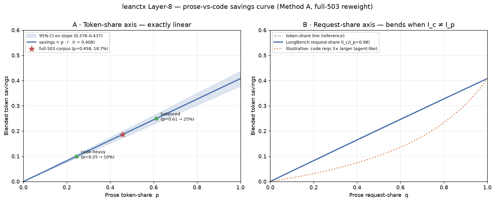

# Prose-vs-code savings curve — Method A (full-503 reweight)

**Source:** `full503_phase1_results.jsonl` (503 LongBench-v2 Leg-B items)
**Method:** reweight existing per-item route splits — **no new benchmark run, no API spend**.
**Scope:** single axis, prose-share vs code-share. Accuracy is out of scope (LongBench v2 covers it).

> Generated by `benchmarks/clawrouter/reweight_prose_code_curve.py`. Re-run to regenerate.

---

## TL;DR

On a **token-share** axis the curve is an exact straight line through the origin:

```
blended_savings(p) = p · r        p = prose token-share,  r = 0.4079
```

- **Slope r = 40.8%** (per-prose-token savings rate; 95% CI 37.8%–43.7%).
- The full-503 corpus sits at **p₀ = 0.458** → **18.7%** blended savings
  (95% CI 17.3%–20.0%). The published run reported 24.1% for this
  same figure; see `short_route_counterfactual.md` for the per-figure reproduction diff.
- Because LLMLingua-2 is deterministic, every point on the line is **exact arithmetic**, not an estimate.



Curve data: [`prose_code_savings_curve.csv`](prose_code_savings_curve.csv).

---

## 1. The line (token-share axis)

| Prose token-share p | Blended savings (p·r) | 95% CI |
|---|---|---|
| 0.000 | 0.0% | 0.0% – 0.0% |
| 0.100 | 4.1% | 3.8% – 4.4% |
| 0.250 | 10.2% | 9.5% – 10.9% |
| 0.458 ← corpus | 18.7% | 17.3% – 20.0% |
| 0.500 | 20.4% | 18.9% – 21.8% |
| 0.750 | 30.6% | 28.4% – 32.8% |
| 0.900 | 36.7% | 34.0% – 39.3% |
| 1.000 | 40.8% | 37.8% – 43.7% |

The three traffic regimes named in issue #2 map to these prose-shares:

| Regime | Prose token-share needed | Blended savings |
|---|---|---|
| code-heavy | 0.245 | 10.0% |
| balanced | 0.613 | 25.0% |
| prose-heavy | 1.103 | 45.0% |

So leanctx clears the 20% gate once traffic is **≳ 49% prose by tokens**; below that it
under-delivers, above ~85% prose it approaches the ~41% compressor ceiling.

---

## 2. Token-share vs request-share (the bend)

Real users think in *requests* ("what % of my requests are coding?"), not tokens. The request-share
curve is:

```
savings(q) = q·I_p·r / (q·I_p + (1−q)·I_c)
```

where I_p, I_c are the mean input tokens of a prose vs a code request. It bends **below** the token-share
line whenever code requests are larger (I_c > I_p), because code then eats a disproportionate token share.

**On LongBench this bend is negligible:** I_p = 26,649 tok,
I_c = 26,188 tok → **I_c/I_p = 0.98**. LongBench items are all ~26K-token
documents regardless of type, so request-share ≈ token-share and both axes are linear here.

⚠️ **This is a LongBench artifact, not a general result.** In real agent traffic, code/tool/log dumps are
much larger than chat turns (I_c/I_p ≈ 3–10×), which bends the request-share curve well below linear — a
50%-prose-by-requests stream can be ~25%-prose-by-tokens. Panel B shows an illustrative I_c/I_p = 3 curve.
Quantifying the real bend is a **Method B** question (clean prose + code corpora at realistic sizes).

---

## 3. The slope band — how r varies by prose sub-type

The single slope `r` hides variation across prose content types. Per-domain r (prose/Lingua items only):

| Prose content domain | Compressible input tokens | r |
|---|---|---|
| Single-Document QA | 1,911,972 | 0.553 |
| Long In-context Learning | 1,675,393 | 0.278 |
| Long Structured Data Understanding | 1,207,341 | 0.323 |
| Long-dialogue History Understanding | 722,000 | 0.356 |
| Multi-Document QA | 559,197 | 0.551 |

Spread is ~27 points
(27.8%–55.3%).
Structured-data prose compresses least; dialogue/single-doc prose most. Real traffic's r depends on which
prose sub-types dominate — another reason to validate the slope on representative prose (Method B / MeetingBank).

---

## 4. Caveats (read before quoting a number)

1. **"Code" here = all LongBench verbatim-routed content** (code repos, structured data, errors) — not
   literally source code. The axis is really *compressible-prose vs everything-else*.
2. **r = 40.8% is LongBench-flavored.** LongBench prose is academic QA context; chat / RAG / transcripts
   compress differently. MeetingBank (Lingua-2's own eval) is the honest best-case anchor.
3. **The request-share bend is corpus-specific** (driven by I_c/I_p, which is ~1 on LongBench but ≫1 in
   agent traffic). Its *existence* is general; its *magnitude* needs Method B.
4. **Production point is one point on this line.** The Anthropic Economic Index puts ~35% of Claude traffic
   in coding tasks — but that is a task-category share, not a code-*token* share (a coding task is mostly
   prose: instructions, explanations). Treat it as loose orientation only.

---

## 5. Reproduce

```bash
.venv/bin/python benchmarks/clawrouter/reweight_prose_code_curve.py
```

Reads `full503_phase1_results.jsonl`; writes `prose_code_savings_curve.png`, `prose_code_savings_curve.csv`, and this report.
